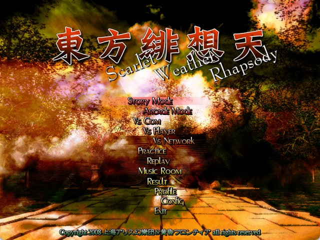

# 東方緋想天 ～ Scarlet Weather Rhapsody

<p align="center">
  
</p>

<p align="center">
  
</p>

This project aims to reconstruct the source code of the original Japanese
`東方緋想天 ～ Scarlet Weather Rhapsody` version 1.06a executable, with
reproducible binary comparison as the acceptance criterion.

The project is in active reverse engineering. The target has been fingerprinted
and fully imported into Ghidra; reconstructed routines are counted only after
an exact function-byte comparison. The progress graphic above is generated
from the machine-readable function ledger.

## Target executable

Supply your own original executable as `resources/th105.exe`:

| Property | Required value |
| --- | --- |
| Original archive member | `th105c.exe` |
| Size | `3,039,232` bytes |
| SHA-256 | `49c23d9467b9927ba687ed2b873c4bc2d2f39ddadc9f55051ccf10172c0b7c11` |
| PE image base | `0x00400000` |

Localized executables are different binaries and are intentionally rejected.
The executable and game data are copyrighted assets and are not included.

```bash
scripts/import-target.sh /path/to/th105.rar
python3 scripts/verify-target.py
```

## Reverse-engineering environment

The repository prefers IDA Pro MCP for semantic analysis when a verified IDA
session is available, with Ghidra 12.1/GhidraMCP as an independent fallback
and current function-inventory authority. Exact acceptance still uses reccmp
and objdiff-style object comparison. The workflow borrows the proven
mapping/build/report structure of the GensokyoClub TH06 and TH08 projects,
while adding a machine-readable function ledger and project-scoped MCP
launchers for coding agents.

For IDA-first work, open the exact target, start its MCP plugin, register the
stdio bridge as `ida-pro-mcp`, and run:

```bash
python3 scripts/check-ida-mcp.py
```

If IDA is unavailable, register the `th105-ghidra` fallback once and verify the
complete MCP protocol path with:

```bash
scripts/bootstrap-tools.sh
scripts/bootstrap-ghidra-project.sh
scripts/register-codex-mcp.sh
codex mcp list
.tools/src/ghidra-mcp/.venv/bin/python scripts/check-mcp.py
```

The launcher starts the analyzed headless project on loopback when needed.
See [docs/MCP.md](docs/MCP.md) for setup and security details.

## Project map

- [Architecture](docs/ARCHITECTURE.md) — confirmed binary structure and module plan
- [Reverse-engineering workflow](docs/RE_WORKFLOW.md) — evidence and agent handoff rules
- [Workflow evolution decision](docs/WORKFLOW_EVOLUTION.md) — gated rollout from
  strict ledger/comparator foundations through packets, clone fan-out, objdiff,
  linking, and runtime validation
- [IDA-first analysis](docs/IDA_MCP.md) — exact routing, boundary safety, and Ghidra fallback
- [Reconstruction map](docs/RECONSTRUCTION_MAP.md) — unlock-first gameplay and character tree
- [Gameplay reconstruction framework](docs/CORE_FRAMEWORK.md) — core lanes,
  ABI/type contracts, dependency graph, and agent-ready worklist
- [Matching workflow](docs/BUILD_MATCHING.md) — compiler, reccmp, and objdiff stages
- [Exact-matching pattern catalog](.agents/skills/th105-re/references/exact-matching-patterns.md) — reusable VC8, COFF, relocation, and source-shaping techniques
- [Exact-matching skill](.agents/skills/th105-matching/SKILL.md) — focused mismatch classification and verified UI/input-era VC8 case studies
- [UI reconstruction framework](docs/UI_FRAMEWORK.md) — scenario-select ABI, call graph, and shared menu helpers
- [Progress](docs/PROGRESS.md) — generated from `config/functions.csv`
- [AGENTS.md](AGENTS.md) — mandatory operating rules for coding agents
- [Parallel-agent skill](.agents/skills/th105-parallel/SKILL.md) — safe,
  high-throughput IDA/Ghidra/ledger delegation

Regenerate and validate the tracking data with:

```bash
python3 scripts/generate-tracking.py
python3 scripts/core-worklist.py --check
python3 scripts/progress.py --check
python3 scripts/validate-tracking.py
```

## Build status

The PE Rich header and linker metadata point to Visual C++ 2005 (VC8), including
42 C++ LTCG records. VC8 SP1 already reproduces the tracked matching routines
exactly, but the original service level, complete flags, translation-unit
partition, and link order are still being established. A matching full
executable is not yet advertised. See
[docs/BUILD_MATCHING.md](docs/BUILD_MATCHING.md).

## License

Repository-authored code and documentation are provided under the MIT License.
This does not grant rights to the original game or its assets.
