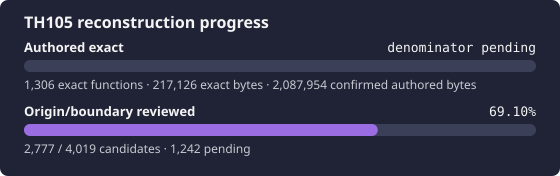

# 東方緋想天 ～ Scarlet Weather Rhapsody

<p align="center">
  
</p>

This project reconstructs the original Japanese TH10.5 version 1.06a
executable with reproducible byte comparison as the acceptance criterion.

## Exact target

Supply your own `resources/th105.exe`:

| Property | Required value |
| --- | --- |
| Version | original Japanese 1.06a |
| Size | `3,129,344` bytes |
| SHA-256 | `56350024879199861579c11b0e1c67b9590e10a8d40cd5996b109deec9afca7e` |
| MD5 | `2ae711a6c92c4addbdbf526bc61d8e59` |
| Image base | `0x00400000` |
| Entry point | `0x0068B9D2` |

The [official 1.06a updater](https://tasofro.net/touhou105/download.html),
`th105_update_106a.exe`, contains this executable. The old `th105c.exe`/1.06
target is different and is deliberately rejected.

```bash
scripts/import-target.sh /path/to/th105.exe
python3 scripts/verify-target.py
```

Copyrighted executables and game data are not included.

## Workflow status

The project now uses the same conservative control-plane model as the TH08
reconstruction: mapping, source presence, exact matches, and library origin are
separate facts. TH105 keeps a separate provisional boundary/origin ledger
because IDA reports 4,001 candidates and VC8 LTCG makes naïve function/TU
accounting unsafe.

The retained source tree came from the former 1.06 effort. It is available as
supporting evidence but contributes zero 1.06a progress until individually
revalidated and compared.

Start a session with:

```bash
python3 scripts/verify-target.py
python3 scripts/check-ida-mcp.py
python3 scripts/report-reconstruction-status.py --summary
python3 scripts/validate-tracking.py --require-target
```

## Documentation

- [Current handoff](docs/RE_HANDOFF.md)
- [Architecture and TH08/TH105 differences](docs/ARCHITECTURE.md)
- [Reverse-engineering workflow](docs/RE_WORKFLOW.md)
- [Tool routing](docs/TOOLS.md)
- [Verified knowledge base](docs/KNOWLEDGE_BASE.md)
- [IDA MCP attestation](docs/IDA_MCP.md)
- [VC8 matching](docs/BUILD_MATCHING.md)
- [Generated progress](docs/PROGRESS.md)
- [Agent rules](AGENTS.md)

Run public, target-independent checks with `python3 scripts/ci.py`. Local target
and IDA checks are intentionally separate.

## License

Repository-authored code and documentation are provided under the MIT License.
This does not grant rights to the original game or its assets.
